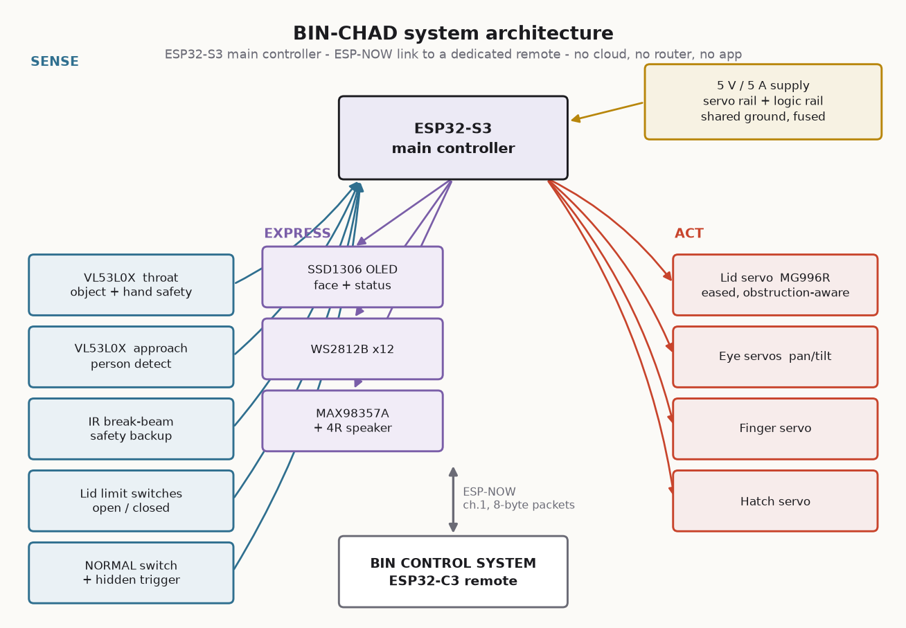

# BIN-CHAD

### The Uncooperative Waste Management System

A trash can that is technically intelligent and deliberately unhelpful.

It detects you. It looks at you. It opens for your rubbish, comments on your
throwing, and takes commands from a large industrial remote control that it
almost never obeys. There is a big illuminated button on the front labelled
**NORMAL MODE**. Press it and the bin becomes an ordinary, well-behaved
automatic dustbin — for about four seconds. Then a small hatch opens, a
comically oversized mechanical finger emerges, switches NORMAL MODE off, and
retracts.

That is the whole project. It works, it is safe, and it took a genuinely
unreasonable amount of engineering.



---

## What is in this repository

| Path | Contents |
|---|---|
| `firmware/BinChad/` | Main controller firmware (ESP32-S3). Arduino sketch, modular `src/` tree. |
| `firmware/BinRemote/` | Remote firmware (ESP32-C3). |
| `cad/` | Parametric OpenSCAD source for all 24 printed parts. |
| `docs/` | Generated diagrams (regenerate with `python tools/render_docs.py`). |
| `tools/` | Diagram renderer, WAV generator, and a static consistency checker. |
| `BOM.csv` | Full bill of materials with prices and search links. |
| `PINOUT.md` | Exact GPIO map for both boards, plus the pins you must not touch. |
| `WIRING.md` | Power budget, distribution, connection tables, the servo cutoff circuit. |
| `BUILD_GUIDE.md` | Step-by-step assembly and calibration. |
| `CAD_README.md` | Every printed part: dimensions, print settings, the torque budget. |
| `FIRMWARE_README.md` | Module-by-module architecture, build setup, tuning. |
| `REMOTE_PROTOCOL.md` | ESP-NOW packet format and the mistranslation engine. |
| `TEST_PLAN.md` | Endurance, safety and reliability test checklist. |
| `TROUBLESHOOTING.md` | The eight failures you are actually going to hit. |
| `HACKATHON_DEMO.md` | The two-minute demo script and the failure-proofing. |

---

## The five things it does

**1. It watches you.**
A VL53L0X pointing into the room notices someone approaching. The servo-mounted
eyeball turns toward them. The OLED says `OH NO.`

**2. It reacts to your throw.**
A second VL53L0X looks down the bin's throat. The lid opens on detection
(< 300 ms), waits, and decides whether the object actually went in.
It did: *"Acceptable."* It did not: two full seconds of silence, direct eye
contact, then *"My grandmother throws better."*

**3. It disobeys the remote.**
A dedicated ESP32-C3 remote — oversized, antenna'd, labelled
**PLEASE DO NOT TRUST** — sends honest ESP-NOW packets. The bin runs them
through a deterministic mistranslation engine: OPEN closes, CLOSE opens, LEFT
looks right, STOP makes everything faster, MUTE turns the volume up. The more
you press, the less it complies.

**4. It disables its own NORMAL MODE button.**
The signature mechanism. Documented in full in §"The punchline" below.

**5. It never hurts anyone.**
The lid is eased at both ends and cannot slam. Two independent sensors watch
the closing zone; either one stops the lid and reverses it, and the bin
apologises — the one thing it is never sarcastic about. Limit switches verify
both endpoints rather than trusting the servo angle. A master switch and a
firmware-controlled MOSFET both cut actuator power, and the safe state is the
default state.

---

## The punchline


```
   user presses NORMAL MODE
            ↓
   bin becomes a completely normal automatic bin
            ↓
   ~4.5 seconds pass. The lid opens and closes properly. It is well behaved.
            ↓
   the eye turns, slowly, to look at the button
            ↓
   900 ms of nothing
            ↓
   a hatch opens in the front panel
            ↓
   900 ms of nothing (this pause is the joke)
            ↓
   an absurd finger extends and flips the switch OFF
            ↓
   the finger verifies the switch actually moved, and retries once if not
            ↓
   finger retracts, hatch closes
            ↓
   display:  NORMAL MODE CANCELLED
```

The eye looking at the button first is deliberate: telegraphing the move is
what turns a mechanism into a joke.

---

## Design rules this project follows

**Serious engineering, ridiculous purpose.** Every subsystem is built as if it
mattered. None of it matters.

**The machine is the attraction.** No app, no cloud, no router, no dashboard.
ESP-NOW is peer-to-peer; unplug the venue's Wi-Fi and nothing changes.

**Comedy never overrides safety.** The priority order, applied to every design
decision in this repo:

```
SAFETY → RELIABILITY → PHYSICAL COMEDY → MECHANICAL QUALITY
       → DEMO SPEED → VISUAL APPEAL → TECHNICAL COMPLEXITY
```

**Nothing blocks.** There is not a single `delay()` after `setup()` returns.
Everything is a `millis()` state machine, because the lid must keep checking
for fingers while audio plays, LEDs animate and packets arrive.

**Nothing is glued.** Every module comes out on M3 screws into heat-set
inserts. The electronics tray slides out of the back with the loom attached.
The lid lifts off by pulling one hinge pin. You will be debugging this on a
table with ten minutes to go.

**It degrades instead of failing.** A dead ToF sensor sets a flag and the bin
carries on. A missing WAV file is silent, not a crash. A lost remote produces
`REMOTE LOST / Good.` A lid fault shows `Have you tried turning me off?` and
keeps the rest of the machine alive.

---

## Quick start

```bash
# 1. Print the parts (see CAD_README.md for the plate order and settings)
openscad -o lid_frame.stl -D 'part="lid_frame"' cad/lid_mechanism.scad

# 2. Wire it (PINOUT.md, then WIRING.md)

# 3. Prepare the sounds
python tools/make_wavs.py            # generates placeholder clips into firmware/BinChad/data/

# 4. Flash the bin
#    Arduino IDE -> firmware/BinChad/BinChad.ino
#    Board: ESP32S3 Dev Module | USB CDC On Boot: Enabled
#    Then: Tools -> ESP32 Sketch Data Upload  (writes data/ to LittleFS)

# 5. Flash the remote
#    Arduino IDE -> firmware/BinRemote/BinRemote.ino
#    Board: ESP32C3 Dev Module | USB CDC On Boot: Enabled

# 6. Calibrate (BUILD_GUIDE.md §7) - servo endpoints, then ToF thresholds

# Any time you edit a pin map, protocol.h, or settings.h:
python tools/verify_project.py       # duplicate GPIOs, diverged protocol
                                     # copies, undefined methods, broken doc
                                     # links, bad WAVs, contradictory settings
```

Build it in the order given in `BUILD_GUIDE.md` §1. One subsystem at a time,
each one tested before the next goes on. Wiring the whole thing and then
flashing it is how you end up debugging five problems at once at 3 a.m.

---

## Status and scope

**In the base build, and working:** lid with soft-close and obstruction
detection, dual ToF sensing, servo eye, OLED face, LED patterns, I²S audio,
the finger mechanism, the ESP-NOW remote, the mistranslation engine, the
personality state machine, self-test, and the hidden demo trigger.

**Deliberately optional** (in `README` terms: do not build these until the base
machine is boring and reliable):

- Camera-based face tracking and thrown-object detection (`OV2640`)
- Trajectory prediction
- Voice input
- Multiple stored personalities and per-user memory

The base machine must work with the camera physically removed. That is not a
style preference — it is the difference between a demo that survives a badly
lit conference hall and one that does not.

**Not verified here:** the firmware has not been compiled and the OpenSCAD has
not been rendered in this environment — no toolchain was available. Treat the
first build as a bring-up, and expect to fix a missing include or a tight
tolerance. Every module was written against the documented library APIs and
reviewed by hand.

---

## Naming

The bin answers to **BIN-CHAD**. It has also been called TrashGPT, BIN.exe,
RejectBin, Garbage Intelligence, and The Refuser. Rename it in
`display.cpp::bootScreen()` and on the remote's faceplate label.

Judges are expected to ask *"why does this exist?"*

The answer is: because we could build it.
